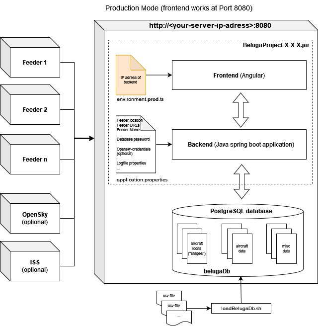

## Install

This manual will give you instructions to run the Beluga Project on a Debian based system like RasbianOS or Ubuntu.

Local installation was tested on Ubuntu 20.04 and on Ubuntu 18.04. Server installation was tested on Raspbian GNU/Linux 10 (buster) and on Raspberry Pi OS Debian 11 (bullseye).

If you just want to try out BelugaProject without changing your system we recommend to use a virtual machine created with [Gnome Boxes](https://en.wikipedia.org/wiki/GNOME_Boxes).

If you face any issues please let us know. Happy installing!

<details>
<summary><b>Table of Contents</b> (click to open)</summary>
<!-- MarkdownTOC -->

- [Overview](#overview)
- [Install dependencies](#Install-dependencies)
- [Setup PostgreSQL for BelugaProject](#Setup-PostgreSQL-for-BelugaProject)
  - [Create PostgreSQL user and database for BelugaProject](#Create-PostgreSQL-user-and-database-for-BelugaProject)
  - [Enable networking for PostgreSQL](#Enable-networking-for-PostgreSQL)
  - [Configure remote access for PostgreSQL](#Configure-remote-access-for-PostgreSQL)
- [Install further dependencies](#install-further-dependencies)
- [Configure application properties](#configure-application-properties)
- [Configure IP adress of backend service (local system)](#configure-ip-adress-of-backend-service--local-system-)
- [Build BelugaProject jar file (local system)](#build-belugaproject-jar-file--local-system-)
  - [Build BelugaProject with build script](#Build-BelugaProject-with-build-script)
  - [Run BelugaProject](#Run-BelugaProject)
  - [Manual Build of BelugaProject](#Manual-Build-of-BelugaProject)
  - [Build BelugaProject from IDE](#build-belugaproject-from-ide)
- [Load database tables](#load-database-tables)
- [Deployment to remote server](#deployment-to-remote-server)
  - [Build jar file (on local system)](#build-jar-file-on-local-system)
  - [Setup server (Raspberry Pi)](#setup-server-raspberry-pi)
  - [Configure application properties for server](#Configure-application-properties-for-server)
- [Check database tables](#check-database-tables)

<!-- /MarkdownTOC -->
</details>

### Overview

The BelugaProject consists of a java spring boot server application as backend, a postgres database and an angular frontend.

<p align="center">


It requires a java runtime system, Maven (for building the BelugaProject jar-file with dependencies), postgres database and angular. If you want to develop the app, you need an IDE (like Intellij or eclipse), angular and (optionally) git.

It is necessary to configure the postgres database including a postgres user "beluga". Running the application on a server requires to create an unix user "beluga" aswell. For local testing the unix user "beluga" is optional.

Next step is to adapt the config files `application.properties` and `environment.prod.ts` for your installation. Then the build process can be executed. The result is a file `BelugaProject-X-X-X.jar` (X-X-X is replaced by the version number) which can be run on your local system. At first run the spring boot application creates the database tables. They have to be filled with a load-script afterwards.

Finally the `BelugaProject-X-X-X.jar` file with the corresponding configuration should be deployed to a dedicated server system such as a RaspberryPi. The server has to be set up similarly to the local system before.

### Install dependencies

This can be done with the provided script `install_dependencies.sh` in `/assets/Scripts`.
Execution requires sudo, so you may check the script code before.

It will install the dependencies needed
to run and build the Beluga Project. If you are running
this script on your production server (lika a Raspberry Pi)
you can skip the installation of dependecies only needed for
building the jar file of the Beluga Project.

Dependencies needed for running the Beluga Project:

- Java (at least Java 14, script will install Java 17)
- Postgresql

Dependencies needed for building the Beluga Project:

- Maven 3.8.6

  (or later, please check latest version [here](https://maven.apache.org/download.cgi) and if required change version in "# globals" section of `install_dependencies.sh`)

- Nodejs 16.x
- Npm
- Angular

```
  $ cd /assets/Scripts
  $ sudo ./install_dependencies.sh
```

### Setup PostgreSQL for BelugaProject

#### Create PostgreSQL user and database for BelugaProject

- Connect to postgres psql console with user `postgres`

  ```
  $ sudo -i -u postgres
  $ psql
  ```

- Try to list all db

  ```
  postgres=# \l
  ```

- Create postgres user `beluga` (output should be "CREATE ROLE")

  ```
  postgres=# CREATE ROLE beluga WITH LOGIN SUPERUSER CREATEDB CREATEROLE INHERIT REPLICATION CONNECTION LIMIT -1;
  ```

- Create user default database for postgres user `beluga` (output should be "CREATE DATABASE")

  ```
  postgres=# CREATE DATABASE beluga WITH OWNER = beluga ENCODING = 'UTF-8' TABLESPACE = pg_default CONNECTION LIMIT -1;
  ```

- Set a password for postgres user `beluga`

  ```
  postgres=# \password beluga
  ```

- Log out of psql console

  ```
  postgres=# \q
  ```

- Login to psql console as newly created user `beluga`

  ```
  $ psql -U beluga -h 127.0.0.1
  ```

- Create `belugaDb` database with user `beluga` (output should be "CREATE DATABASE")

  ```
  beluga=# CREATE DATABASE "belugaDb";
  ```

- Log out of psql console

  ```
  beluga=# \q
  ```

- Log out as user `postgres`

  ```
  $ exit
  ```

- Configure local login for user `beluga`

  ```
  $ cd /etc/postgresql/<yourVersion>/main
  $ sudo nano pg_hba.conf
  ```

  To avoid that user database user `beluga` must enter a password on local system add this line for user `beluga` to `pg_hba.conf` right before the line `local all all peer`.

  ```
  # "local" is for Unix domain socket connections only
  local   all             beluga                                  trust
  local   all             all                                     peer
  ```

- Restart postgresql service

  ```
    $ sudo systemctl restart postgresql
  ```

- Check that postgresql service is running

  ```
    $ sudo systemctl status postgresql
  ```

- If postgresql restart fails, check postgresql logfile (replace XX with postgresql version number)
  ```
    $ sudo nano /var/log/postgresql/postgresql-XX-main.log
  ```
  Check that there is no problem with `pg_hba.conf`.

#### Enable networking for PostgreSQL

By default PostgreSQL listens to `localhost` only. If remote access to PostgreSQL is required, listening to foreign IP-addresses must be configured (typically on a server installation).

- Open `postgresql.conf`

  ```
  $ cd /etc/postgresql/<yourVersion>/main
  $ sudo nano postgresql.conf
  ```

- Find the line
  `#listen_addresses = 'localhost'`
- Change it to
  `listen_addresses = '*'`
  (**important**: remove the '#')

- Save and exit

- Restart PostgreSQL service

  ```
  $ sudo systemctl restart postgresql
  ```

- If PostgreSQL restart fails, check PostgreSQL logfile (replace XX with postgresql version number)
  ```
  $ sudo nano /var/log/postgresql/postgresql-XX-main.log
  ```
  Check that there is no problem with `postgresql.conf`.

#### Configure remote access for PostgreSQL

The following step is optional. It is required if you want to manage the PostgreSQL database from a remote system or need direct access to it (e.g. with pgAdmin-Tool or DBeaver). It is **not** required for BelugaProject-clients, because they access the database only via BelugaProject-webservices.

- Change file `pg_hba.conf`
  ```
  $ cd /etc/postgresql/<yourVersion>/main
  $ sudo nano pg_hba.conf
  ```
- Add the following line(s) with your resp. IP address from where you want to access the database (save and exit).

  ```
  host    all        all      192.168.XXX.XX/24      trust
  ```

- Check that `/24` follows your IP-adress!

- Restart PostgreSQL service
  ```
  $ sudo service postgresql restart
  ```
- If postgresql restart fails, check postgresql logfile (replace XX with postgresql version number)
  ```
  $ sudo nano /var/log/postgresql/postgresql-XX-main.log
  ```
  Check that there is no problem with `pg_hba.conf`.

### Install further dependencies

(if you want to dive into development)

- pgAdmin4 or DBeaver

- An IDE like Intellij IDEA

### Configure application properties

To be able to run the spring boot application you have to provide some information in the configuration file `application.properties` in `/server/src/main/resources/config` which is used when you run the application.

First duplicate template file `application.properties.template` and name it `application.properties`. To configure the file use following instructions to replace the `TODO`s. If you missed to provide some information or forgot to replace some `TODO`s the application start may fail or some features will not work properly.

When configuring multiple feeders the order of the entries in the following instructions are important. The first entries in `ipFeeder`, `typeFeeder`, `nameFeeder` and `colorFeeder` belong to the same feeder as well as the second and so on.

- Set your feeder location. Replace the values with your antenna position coordinates. Later this will be the shown on the map with an antenna icon.

  ```
  latitudeLocation=54.1234
  longitudeLocation=8.1234
  ```

- Enter the URLs of your feeders with an json output seperated by comma.

  - for AirSquitter use the URL `http://XXX.XXX.XXX.XX/aircraftlist.json`
  - for tar1090 use the URL `http://XXX.XXX.XXX.XX/tar1090/data/aircraft.json`
  - for adsbx use the URL `http://XXX.XXX.XXX.XX/adsbx/data/aircraft.json`
  - for fr24feeder (dump1090) use the URL `http://XXX.XXX.XXX.XX/dump1090/data/aircraft.json`
  - for dump1090-fa use the URL `http://XXX.XXX.XXX.XX/dump1090-fa/data/aircraft.json`

  ```
  ipFeeder=URL1, URL2
  ```

  If you do not have a local feeder, set `ipFeeder=NONE`.

- Enter the type of your feeders (currently supported: adsbx, airsquitter, dump1090-fa, fr24feeder)

  ```
  typeFeeder=typeoffeeder1, typeoffeeder2
  ```

  If you do not have a local feeder, set `typeFeeder=NONE`.

- Enter the name of your feeders seperated by comma. Name should be not too long to fit well in control elements.

  ```
  nameFeeder=Name1, Name2
  ```

  If you do not have a local feeder, set `nameFeeder=NONE`.

- Enter the color of your feeders seperated by comma. This color is used later in statistical views

  ```
  colorFeeder=red, blue
  ```

  If you do not have a local feeder, set `colorFeeder=NONE`.

- Enter the amount of your feeders

  ```
  amountFeeder=2
  ```

  If you do not have a local feeder, set `amountFeeder=1` (this value must match with the amount of feeder configuration entries).

- Database properties: Set password for the database `belugaDb`

- Opensky-Credentials: (Optional) Replace `TODO`s with your opensky network credentials. If you do not provide credentials this function will be disabled.

- Search engine url to search for aircraft pictures when planespotters.net does not find results (default is startpage): (Optional) Replace given url with a new one. Important: `<PLACEHOLDER>` is required, because it will be replaced with registration or hex

It is possible to configure application.properties **after** building the jar-file. You will find instructions in [Configure application properties for server](#Configure-application-properties-for-server).

### Configure IP adress of backend service (local system)

To tell the frontend where to find the backend server it is required to set the IP address of your backend server in file `/webapp/src/environments/environment.prod.ts`.

Open file and replace `TODO` in parameter `baseUrl` with the IP address of your local system.

### Build BelugaProject jar file (local system)

<p align="center">


After configuring `application.properties` and `environment.prod.ts` the build process can be executed. There are three different build methods described below.

#### Build BelugaProject with build script

You can do this with the provided script `build.sh` in `/assets/Scripts` folder.

Make the script executable with

```
chmod +x build.sh
```

Execute the script with

```
./build.sh
```

The gentle reminder prompts to check the URL and the version can be accepted with `y`.

Building the frontend requires some memory. The build may fail with an error message like
`Generating browser application bundles (phase: building)... 16869 Killed`
if your system has less then 3 GiB RAM.

#### Run BelugaProject

After successful build process run the application (replace X-X-X with current version) with

```
$ cd /server/prod
$ java -jar BelugaProject-X-X-X.jar
```

On first startup of the spring boot application the tables in database `belugaDb` are created automatically.

You can check this, see [Check database tables](#check-database-tables).

If you missed to provide some information in the file `application.properties` the application start may fail or some features will not work properly. In this case check if you have filled all entries in `application.properties`.

Don't worry, if just the map but no aircraft appears. Displaying aircraft icons requires loading of database tables as described in [Load database tables](#load-database-tables).

The application is running on port 8080, open you browser and go to `http://localhost:8080/`.

#### Manual Build of BelugaProject

If you have no IDE installed, you can build the angular frontend and the java spring boot backend JAR-file in a Terminal.

- Build the angular frontend

  ```
  $ cd /webapp
  $ ng build --prod
  ```

  This process may take some time.

  Building the frontend requires some memory. The build may fail with an error message like
  `Generating browser application bundles (phase: building) ... 16869 Killed`
  if your system has less then 3 GiB RAM.

- Build the spring boot application
  ```
  $ cd /server
  $ mvn clean install
  ```
  This process may take some time.
- After successful build run the application, see [Run BelugaProject](#Run-BelugaProject).

#### Build BelugaProject from IDE

Alternatively you can build the backend and the frontend from your IDE.

For building the backend open the `/server` folder in your IDE (Intellij or eclipse) as new project and build the application.

For building the frontend go to `/webapp` folder. If you are opening the angular application for the first time, run `npm install` first.

Execute command

```
ng serve --open
```

If your browser is not open yet, go to `http://localhost:4200/`.

Don't worry, if just the map but no aircraft appears. Displaying aircraft icons requires loading of database tables as described in [Load database tables](#load-database-tables).

When building the frontend this way file `environment.ts` with `baseUrl: 'localhost'` is used instead of `environment.prod.ts`.

Building the frontend requires some memory. The build may fail with an error message like
`Generating browser application bundles (phase: building)... 16869 Killed`
if your system has less then 3 GiB RAM.

### Load database tables

**Important:** This step requires that the spring boot application has been executed before at least one time to create the database tables. You can check this, see [Check database tables](#check-database-tables).

To fill the database tables use the following instructions.

The provided csv file `operator_data.csv` is based on [https://en.wikipedia.org/wiki/List_of_airline_codes](https://en.wikipedia.org/wiki/List_of_airline_codes).

- For the table `aircraft_data` download the file `aircraftDatabase.csv` from Opensky-Network at [https://opensky-network.org/datasets/metadata/](https://opensky-network.org/datasets/metadata/)

- For the table `airport_data` download the file `airports.csv` from OurAirports at [https://ourairports.com/data/](https://ourairports.com/data/)

- Unfortunately, if you want to fill the table `flightroute_data` you have to provide the data yourself. The provided csv file is just a sample

- For the tables

  - `country_data`
  - `regcode_data`
  - `operator_data`
  - `map_cat_to_shape`
  - `map_type_to_shape`
  - `shape_data`

    use the provided csv files in `assets/dbContent`.

- For the tables

  - `aircraft_data`
  - `airport_data`

    copy the downloaded files to `.../assets/dbContent`.

  To load the csv-files it is necessary that the files can be accessed by postgres. Therefore create a folder `dbContent` inside the postgres folder.

  ```
  $ cd /var/lib/postgresql/
  $ sudo mkdir dbContent
  ```

- Copy all csv-files to the newly created directory `/var/lib/postgresql/dbContent`

- In the script `loadBelugaDb.sh` set the path in `pathToDirectoryWithCsv` to the directory with the csv-files (e.g. `/var/lib/postgresql/dbContent`)

- Make the script `loadBelugaDb.sh` executable

  ```
  $ chmod +x loadBelugaDb.sh
  ```

- Execute the script to import the data from the csv files into the database tables (this might take some time).

  ```
  $ ./loadBelugaDb.sh
  ```

### Deployment to remote server

<p align="center">


#### Build jar file (on local system)

Set the IP address of your server (replace `TODO` at parameter `baseUrl`) in `webapp/src/environments/environment.prod.ts`.

To initialize the angular application, run `npm install` first.

The following steps can be done automatically with the provided build script `build.sh` in `/assets/Scripts`. Make the script executable with `chmod +x build.sh`. Execute the script with `./build.sh`. The gentle reminder prompts to check the URL and the version can be accepted with `y`.

If you don't want to use the build script, follow the manual procedure described here:

- Build the angular application in production mode.

  ```
  $ ng build --prod
  ```

- Go into the `/server` folder. Build the spring boot application with the command below. Afterwards, the jar file should be inside the `/server/target` and `/server/prod` folder.

  ```
  $ mvn clean install
  ```

- For test purpose: Execute the jar file (make sure to replace the version X-X-X in the given filename below)

  ```
  $ java -jar BelugaProject-X-X-X.jar
  ```

- For test purpose: Open your browser and go to `http://<yourIpAddress>:8080/`

  Don't worry, if just the map but no aircraft appears. Displaying aircraft icons requires loading of database tables as described in [Load database tables](#load-database-tables).

#### Setup server (Raspberry Pi)

For permanent use it is recommended to run the Beluga Project on a permanent available server like a Raspberry Pi.

The following instructions will setup the BelugaProject on your Raspberry Pi.

- Log into Raspberry Pi with default user `pi`

- Setup dependencies for the project

  Run script `install_dependencies` from `/assets/scripts/` on your server. Use instructions from [Install dependencies](#install-dependencies).

- Setup Postgresql on server

  - Use instructions from [Create PostgreSQL user and database for BelugaProject](#Create-PostgreSQL-user-and-database-for-BelugaProject)
  - Use instructions from [Enable networking for PostgreSQL](#Enable-networking-for-PostgreSQL)
  - Use instructions from [Configure remote access for PostgreSQL](#Configure-remote-access-for-PostgreSQL)

- Create unix user `beluga`

  ```
  $ sudo adduser beluga
  ```

- Change to unix user `beluga` for the following steps

  ```
  $ su - beluga
  ```

- Create BelugaProject directory in `home/beluga/.local/share/applications/BelugaProject`:

  ```
  $ mkdir .local
  $ cd .local
  $ mkdir share
  $ cd share
  $ mkdir applications
  $ cd applications
  $ mkdir BelugaProject
  ```

- Prepare service (on your local system)

  - Duplicate the `BelugaProject.service.template` file in `/assets/Scripts` and rename it to `BelugaProject.service`.
  - Replace the jar name in line `ExecStart` with the actual jar name.

- Do on your local system:

  - Copy the file `/server/src/resources/config/application.properties` to `/server/prod/config`.
  - Copy the contents of `/server/prod`, the `BelugaProject.service` file and the `loadBelugaDb.sh` to the Beluga Project folder on the Raspberry Pi `/home/beluga/.local/share/applications/BelugaProject`

- Optional: If your local system is a Windows system, convert CRLF in all shellscripts to LF (install and execute dos2unix on the Raspberry Pi)

  ```
  $ sudo apt-get install dos2unix
  $ dos2unix BelugaProject.service
  $ dos2unix loadBelugaDb.sh
  ```

- Install and enable service

  - Check that `BelugaProject.service` has unix file format (LF) (very important step!)
  - Make the script `BelugaProject.service` executable (with user `pi`)

    ```
    $ sudo chmod +x BelugaProject.service
    ```

  - Copy script to systemd/system-directory
    ```
    $ sudo cp BelugaProject.service /etc/systemd/system/
    ```
  - Enable service
    ```
    $ sudo systemctl enable BelugaProject.service
    ```
  - Start service
    ```
    $ sudo systemctl start BelugaProject.service
    ```
  - Check status of service

    ```
    $ sudo systemctl status BelugaProject.service
    ```

  - Check status of postgres & BelugaProject after reboot

  - Check remote access to postgresql via pgAdmin-Tool (installed on Windows or Linux-Client)
  - Check belugaDb: make sure that database tables have been created, see [Check database tables](#check-database-tables)
  - Check that `BelugaProject.service` is active
    ```
    $ sudo systemctl status BelugaProject.service
    ```
  - Check web interface in Browser `http://<your-server-ip>:8080/`

  At this moment no aircraft are visible because database-tables are still empty. Execute step [Load database tables](#load-database-tables) (on server system) to fix this.

#### Configure application properties for server

You can configure the application **after** building the jar file. Duplicate the `application.properties.template` file in `/server/prod/config`, name it to `application.properties` and fill out the file.
To make BelugaProject use the newly created `application.properties` file copy the file inside the `config` directory which should be in the same directory as the jar file. When you have a running server restart the server and if necessary reload the site in the browser. The application should now use the new properties file.

### Check database tables

With the first run of the spring boot application database tables are created automatically. You can check this following the steps listed below.

- Login to postgreSQL as user `beluga` (if you don't have a user `beluga` use the user `postgres` instead in the following commands)
  ```
  $ sudo -i -u beluga
  $ psql
  ```
- Connect to database `belugaDb`
  ```
  beluga=# \c belugaDb
  ```
- List all tables of database `belugaDb`

  ```
  belugaDb=# \dt
  ```

  You should get a result like this:

```
                   Liste der Relationen

  Schema | Name | Typ | Eigentümer
  --------+------------------------+---------+------------
  public | aircraft | Tabelle | beluga
  public | aircraft_data | Tabelle | beluga
  public | aircraft_trail | Tabelle | beluga
  public | airport_data | Tabelle | beluga
  public | country_data | Tabelle | beluga
  public | flightroute_data | Tabelle | beluga
  public | history_aircraft | Tabelle | beluga
  public | history_aircraft_trail | Tabelle | beluga
  public | map_cat_to_shape_data | Tabelle | beluga
  public | map_type_to_shape_data | Tabelle | beluga
  public | opensky_aircraft | Tabelle | beluga
  public | operator_data | Tabelle | beluga
  public | range_data | Tabelle | beluga
  public | regcode_data | Tabelle | beluga
  public | shape_data | Tabelle | beluga
  public | spacecraft | Tabelle | beluga
  public | spacecraft_trail | Tabelle | beluga
  (17 Zeilen)
```
