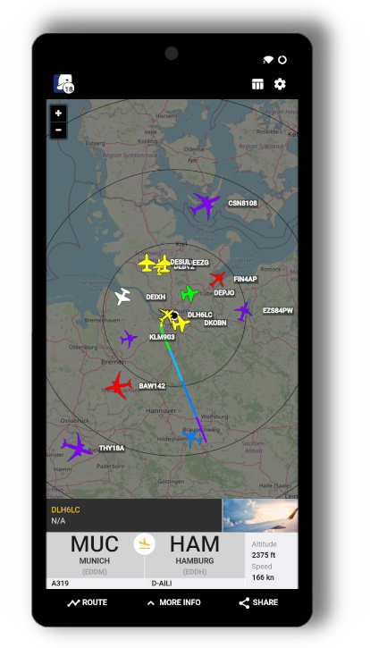
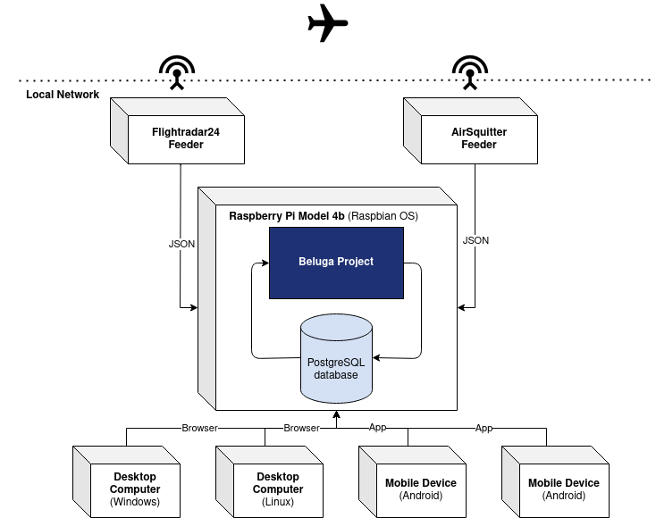

<h1 align="center">The Beluga Project</h1>

Spring Boot Angular web application that displays one or multiple, local ADS-B feeders along with additional information on a map interface in the browser.

Currently you can use this application out of the box with Flightradar24 or AirSquitter feeders. Other ADS-B feeder can be added aswell.

Additional information about the aircrafts are added through a PostgreSQL database with content from [OpenSky-Network](https://opensky-network.org/) and [OurAirports](https://ourairports.com/data/). The ISS (International Space Station) is displayed by default with information from the [Open-Notify-API](http://open-notify.org/Open-Notify-API/ISS-Location-Now/).

## Motivation

We started our ADS-B experience with an [AirSquitter](https://airsquitter.com) receiver. We got good results but because of the antenna position the range was limited to only a half circle around our house. So we added another receiver (Raspberry Pi) with a separate antenna to cover the second half of the circle. This works great. Unfortunately we found no application which can show the aircrafts from both receivers in one map. So we decided to create a new one - The Beluga Project.

## Features

-   Display aircrafts from your local ADS-B feeders on a map in the browser
-   Track the ISS (International Space Station)
-   See additional information about tracked aircrafts like the aircraft model and type, the country of registration and the operator callsign
-   Show range data of your feeders on the map
-   Display aircrafts in a sortable table
-   View the application on your desktop or mobile (for the Android app see use the folder "Android App")

## Screenshots

### Web view

### Mobile view

## General structure of the project

### Backend

-   [Spring Boot](https://spring.io/projects/spring-boot)
-   [PostgreSQL database](https://www.postgresql.org/)

### Frontend

-   [Angular](https://angular.io)
    -   [Angular Material Design](https://material.angular.io/)
-   [OpenLayers](https://openlayers.org/)

## Our Setup

The application runs on a Raspberry Pi 4B in the local network. We can access the map in the browser on desktop computers (Windows and Linux) and on mobile devices. For our mobile devices we use the mobile app.

## Install and run

To install and run the application please see the [INSTALL.md](/INSTALL.md) file.
