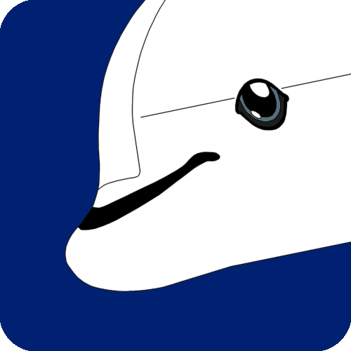
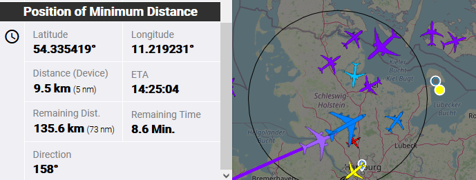
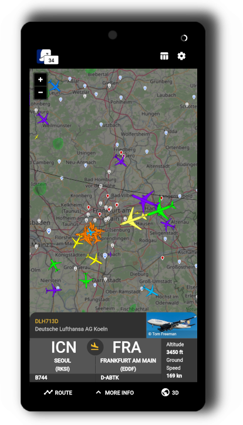
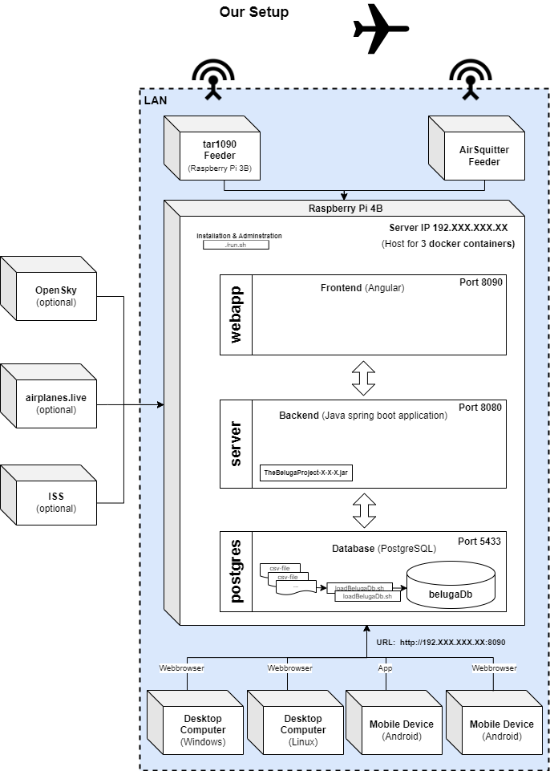

<h1 align="center">The Beluga Project</h1>

Spring Boot Angular web application that displays one or multiple, local ADS-B feeders along with additional information on a map interface in the browser.

Currently you can use this application out of the box with [Flightradar24](https://www.flightradar24.com/), [tar1090](https://github.com/wiedehopf/tar1090) or [AirSquitter](https://airsquitter.com/) feeders. Other ADS-B feeder can be added aswell.

It is possible to run the application only with data from the [OpenSky-Network](https://opensky-network.org/), if you have an account there. So you need no local feeders to try out the app.

Additional information about the aircraft are added through a PostgreSQL database with content from [OpenSky-Network](https://opensky-network.org/) and [OurAirports](https://ourairports.com/data/). The ISS (International Space Station) is displayed by default with information from the [Open-Notify-API](http://open-notify.org/Open-Notify-API/ISS-Location-Now/).

The Beluga Project uses aircraft icons from [this](https://github.com/RexKramer1/AircraftShapesSVG) repository by [RexKramer1](https://github.com/RexKramer1).

## Motivation

We started our ADS-B experience with an [AirSquitter](https://airsquitter.com) receiver. We got good results but because of the antenna position the range was limited to only a half circle around our house. So we added another receiver (Raspberry Pi) with a separate antenna to cover the second half of the circle. This works great. Unfortunately we found no application which can show the aircraft from both receivers in one map. So we decided to create a new one - The Beluga Project.

## Features

- View the application on your desktop or mobile (for the android app see folder "android_app")
- Display on a map in the browser
  - aircraft from your local ADS-B feeders (like tar1090, AirSquitter, fr24feeder)
  - aircraft from Opensky-Network (update interval is 5 seconds)
  - the ISS (International Space Station)
- See additional information about tracked aircraft like model and type, country of registration, operator callsign and more
- Display aircraft picture from planespotters.net
- Show range data of your feeders on the map
- Display aircraft in a sortable table
- Display a list of photos for selected aircraft in your webbrowser (by generated Search-URL)
- Show server logfiles
- Photographers / Spotters can see the „Point of Minimum Distance“ (POMD) for selected aircraft and get ETA, remaining time, remaining distance, distance to aircraft at POMD and view direction at POMD. The yellow point (see image below) shows the „POMD“. The black point is your current position (or antenna position by default). Calculations are based on current track and speed of selected aircraft and are updated permanently.

## Screenshots

### Web view

### Mobile view

## General structure of the project

### Backend

- [Spring Boot](https://spring.io/projects/spring-boot)
- [PostgreSQL database](https://www.postgresql.org/)

### Frontend

- [Angular](https://angular.io)
  - [Angular Material Design](https://material.angular.io/)
- [OpenLayers](https://openlayers.org/)

## Our Setup

The application runs on a Raspberry Pi 4B in the local network. We can access the map in the browser on desktop computers (Windows and Linux) and on mobile devices. For our mobile devices we use the mobile app.

## Install and run

To install and run the application please see the [INSTALL.md](/doc/INSTALL.md) file.
