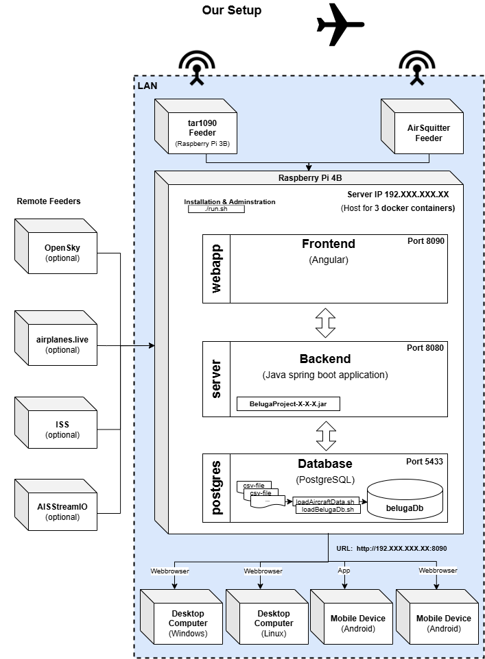

<p align="center">

</p>

<h1 align="center">The Beluga Project</h1>


Spring Boot Angular web application that displays one or multiple, local ADS-B feeders along with additional information on a map interface in the browser.

<p align="center">

</p>

Currently you can use this application out of the box with [Flightradar24](https://www.flightradar24.com/), [tar1090](https://github.com/wiedehopf/tar1090), [AirSquitter](https://airsquitter.com/) or [VirtualRadarServer](https://www.virtualradarserver.co.uk/) (Rebroadcast Server only) feeders. Other ADS-B feeders can be added aswell.

It is possible to run the application only with data from the [OpenSky-Network](https://opensky-network.org/), if you have an account there. Besides you can use data from [Airplanes.live](https://airplanes.live/). So you need no local feeders to try out the app.

Additional information about the aircraft are added through a PostgreSQL database with content from [OpenSky-Network](https://opensky-network.org/), [Mictronics](https://www.mictronics.de/aircraft-database/), [OurAirports](https://ourairports.com/data/), [Virtual Radar Server standing-data](https://github.com/vradarserver/standing-data). Mictronics data is used with [Open Data Commons Attribution License (ODC-By) v1.0](http://opendatacommons.org/licenses/by/1.0/).

The ISS (International Space Station) is displayed by default with information from the ["Where the ISS at?" API](https://wheretheiss.at/w/developer).

Ships (AIS messages) can be displayed from [aisstream.io](https://aisstream.io/). To use this feature you need an API key. Visit their site for more info. [VesselFinder](https://vesselfinder.com/) is used for ship images.

The Beluga Project uses aircraft icons from [this](https://github.com/RexKramer1/AircraftShapesSVG) repository by [RexKramer1](https://github.com/RexKramer1). 3D models from [this](https://github.com/amnesica/BelugaProject-3D-Models) repository are used.

## Motivation

We started our ADS-B experience with an [AirSquitter](https://airsquitter.com) receiver. We got good results but because of the antenna position the range was limited to only a half circle around our house. So we added another receiver (Raspberry Pi) with a separate antenna to cover the second half of the circle. This works great. Unfortunately we found no application which can show the aircraft from both receivers in one map. So we decided to create a new one - The Beluga Project.

## Features

- View the application on your desktop or mobile (for the android app see folder "android_app")
- Display aircraft and airports on a 2D map in the browser
  - Aircraft from your local ADS-B feeders (like tar1090, AirSquitter, fr24feeder, vrs)
  - Aircraft from [OpenSky-Network](https://opensky-network.org/) (update interval is 5 seconds)
  - Aircraft from [Airplanes.live](https://airplanes.live/) (update interval is 5 seconds)
  - The ISS (International Space Station)
  - Airport information from [OurAirports](https://ourairports.com/data/)
- Display selected aircraft on a 3D map ([Cesium Ion](https://cesium.com/), account registration is required to use this feature)
  - Show animated aircraft model and flight path
  - Show Google photogrammetry or OSM 3D buildings
  - Cockpit mode (with or without cockpit model), Follow-Plane mode
  - High Quality mode, HDR, clouds
- Display ships (AIS messages) from [aisstream.io](https://aisstream.io/) (API key is required) (Important: Given that this uses a stream API, it might take some time until all ships are loaded)
- See additional information about tracked aircraft like model and type, country of registration, operator callsign and more
- Track flight progress with route information (origin, destination)
- Display aircraft picture from planespotters.net
- Show range data of your feeders on the map
- Show weather information (current, forecast, clouds) from [Rainviewer](https://www.rainviewer.com/)
- Filter option for military planes
- Choose one of several map styles (2D/3D map, for some of the 2D maps an API key from [Geoapify](https://www.geoapify.com/) is required)
- Display aircraft in a sortable table
- Display a list of photos for selected aircraft in your webbrowser (by generated Search-URL)
- Show server logfiles
- Photographers / Spotters can see the „Point of Minimum Distance“ (POMD) for selected aircraft and get ETA, remaining time, remaining distance, distance to aircraft at POMD and view direction at POMD. The yellow point (see image below) shows the „POMD“. The black point is your current position (or antenna position by default). Calculations are based on current track and speed of selected aircraft and are updated permanently.
<p align="center">


---

**Note**: At the moment The Beluga Project is meant to be used in a local network. It is not recommended to publish it on the web due to security and performance reasons.

---

## General structure of the project

### Backend

- [Spring Boot](https://spring.io/projects/spring-boot)
- [PostgreSQL database](https://www.postgresql.org/)

### Frontend

- [Angular](https://angular.io) with [Angular Material Design](https://material.angular.io/)
- [OpenLayers](https://openlayers.org/)
- [Cesium](https://cesium.com/)
- [ng-apexcharts](https://github.com/apexcharts/ng-apexcharts)

## Our Setup

The application runs on a Raspberry Pi 4B in the local network. We can access the map in the browser on desktop computers (Windows and Linux) and on mobile devices. For our mobile devices we use the mobile app.

<p align="center">

</p>

## Installation/Update

Execute the following command on your Raspberry Pi (or any debian-based system). We recommend using a Pi >=4B with 64 bit OS version.

```
$ sudo bash -c "$(wget -nv -O - https://github.com/amnesica/BelugaProject/raw/master/install.sh)"
```

**Important**: If you already have a version < 4.0.0 of the Beluga Project installed, first execute the following commands and then use the install script with the link above.

```
$ cd BelugaProject
$ sudo ./run.sh docker-rm
$ cd .. && sudo rm -r BelugaProject BelugaProject.zip
```

If you get any error messages have take a look into [TROUBLESHOOTING.md](./doc/TROUBLESHOOTING.md).

## Update standing data

BelugaProject comes with standing data (aircraft data, airport data, flightroute data) which may be outdated meanwhile. So you should update them with command

```
$ sudo ./run.sh update-db
```

This will take some time. On an RaspberryPi 4B update database takes about 10 minutes.
