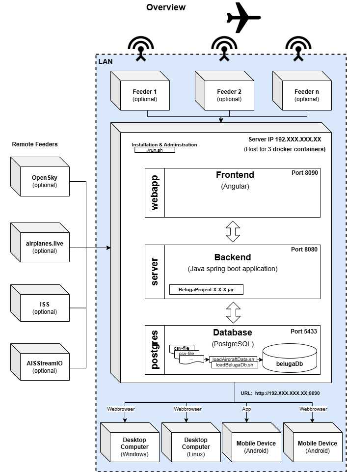

## Install (Docker version)

With this manual you can install the Beluga Project in 3 docker containers on your system. Only docker is required on your machine. Everything else will be taken care of in the container. Run the following instructions on your productive system, e.g. a Raspberry Pi 4B or on your local machine if you just want to test the project. Instructions are mainly for Debian based systems.

If you already have BelugaProject installed in a docker container before, use instructions in [UPDATE.md](./UPDATE.md) instead of this manual.

For `RaspberryPi 4B` it is recommended to use a `64 bit OS` version, because BelugaProject is running significantly faster than on 32 bit OS version.

If you don't have a ADS-B receiver you can use the [Opensky-Network](https://opensky-network.org/). Create an account there first. Besides you may use [Airplanes.live](https://airplanes.live/). 

<p align="center">

</p>

1. Install docker and docker compose (at least version 2) from [here](https://docs.docker.com/desktop/install/ubuntu/) and make it run (do the tutorial if necessary). Use [this](https://docs.docker.com/engine/install/debian/#install-using-the-convenience-script) tutorial for installing docker on a Raspberry Pi. Check the version of docker compose with `docker compose version` (needs to be >=2)

2. Download the Beluga Project from [GitHub](https://github.com/amnesica/BelugaProject) as ZIP and extract it

   ```
   $ wget https://github.com/amnesica/BelugaProject/archive/refs/heads/master.zip -O BelugaProject.zip
   $ unzip BelugaProject.zip
   ```

3. Rename the environment variables template file `.env.template` in `.env` and configure the environment variables in the `.env` file. You can use `nano` for editing the config file.

   ```
   $ cp .env.template .env
   $ nano .env
   ```
   
   For further information on how to configure the `.env` file expand the following section
   <details>
   <summary>Click to expand</summary>

   To be able to run the spring boot application you have to provide some information in the configuration file `.env` which is used when you run the application with docker.

   To configure the file use following instructions to replace the `TODO`s.

   When configuring multiple feeders the order of the entries in the following instructions is important. The first entries in `ipFeeder`, `typeFeeder`, `nameFeeder` and `colorFeeder` belong to the same feeder as well as the second and so on.

   ***

   **Please note**:
   If you miss to provide some information or forgot to replace some `TODO`s the application start may fail or some features will not work properly.

   When you have multiple entries seperated by a comma **do not use blank spaces** like "entry,␣entry".

   ***

   1. Set your **feeder location**. Replace the values with your antenna position coordinates. Later this will be the shown on the map with an antenna icon.

      ```
      latitudeLocation=54.1234
      longitudeLocation=8.1234
      ```

   2. Enter the **URLs** of your feeders with an json output seperated by comma (If you do not have a local feeder, just leave the value empty)

    - for AirSquitter use the URL `http://XXX.XXX.XXX.XX/aircraftlist.json`
    - for tar1090 use the URL `http://XXX.XXX.XXX.XX/tar1090/data/aircraft.json`
    - for adsbx use the URL `http://XXX.XXX.XXX.XX/adsbx/data/aircraft.json`
    - for fr24feeder (dump1090) use the URL `http://XXX.XXX.XXX.XX/dump1090/data/aircraft.json`
    - for dump1090-fa use the URL `http://XXX.XXX.XXX.XX/dump1090-fa/data/aircraft.json`
    - for vrs use the URL `http://XXX.XXX.XXX.XX/VirtualRadar/AircraftList.json`

      ```
      ipFeeder=URL1,URL2
      ```

   3. Enter the **type** of your feeders. Currently supported: adsbx, airsquitter, dump1090-fa, fr24feeder, vrs (If you do not have a local feeder, just leave the value empty)

      ```
      typeFeeder=typeoffeeder1,typeoffeeder2
      ```

   4. Enter the **name** of your feeders seperated by comma. Name should be not too long to fit well in control elements (If you do not have a local feeder, just leave the value empty)

      ```
      nameFeeder=Name1,Name2
      ```

   5. Enter the **color** of your feeders seperated by comma. This color is used later in statistical views (if you do not have a local feeder, set `colorFeeder=red` (valid color is needed here!)

      ```
      colorFeeder=red, blue
      ```

   6. Enter the **amount** of your feeders. This value must match with the amount of feeder configuration entries (If you do not have a local feeder set `amountFeeder=1`)

      ```
      amountFeeder=2
      ```

   7. Production URL for the frontend (`PROD_BASE_URL_WEBAPP`): Enter the URL of your productive systems ip address (for a simple test you can use `localhost`)

   8. Database password (`SPRING_DATASOURCE_PASSWORD`): Set password for the database `belugaDb`

   9. Opensky-Credentials: (**Optional**) Replace `TODO`s with your opensky network credentials. If you do not provide credentials this function will be disabled

   10. Search engine URL to search for aircraft pictures when planespotters.net does not find results (default is startpage): (**Optional**) Replace given URL with a new one. Important: `<PLACEHOLDER>` is required, because it will be replaced with registration or hex.

   11. Add your API-Keys for additional maps (**Optional**)
         ```
         GEOAPIFY_API_KEY=
         CESIUM_ION_DEFAULTACCESSTOKEN=
         CESIUM_GOOGLEMAPS_API_KEY=
         ```
         (without these API-Keys you cannot see all availible maps in settings)

   </details>

4. Build the docker images and execute the containers (webapp, server, postgres) in the base path of Beluga Project.

   `Important:` If you installed docker only for root user, you need to execute the command below with `sudo` privilege

   ```
   $ ./run.sh install
   ```

   This will take some time. On an RaspberryPi 4B

    - container build takes about 14 minutes
    - load database takes about 10 minutes
    - first start in browser takes about 3 minutes until all aircrafts are visible

   If you get error messages please take a look into [TROUBLESHOOTING.md](./TROUBLESHOOTING.md).  

5. When Beluga Project is installed and is running go to `<system-prod-ip>:8090` in your browser. On first run after installation it may take up to about 3 minutes until all aircrafts are visible. If you just want to test the project, enable the Opensky-Network functionality in the settings menu (an Opensky-Network account is needed). 

6. Operation and Maintenance

   Executing 
   ```
   $ ./run.sh
   ```
   will show some options for troubleshooting, operation and **database maintanance**. `Important:` If you installed docker only for root user, you need to execute the command with `sudo` privilege.
   ```
   Usage: ./run.sh command
   commands:
      run                                   Run project with docker compose
      run-bg                                Run project with docker compose (in background)
      docker-build <image_name>             Build docker images (all when empty or specific image)
      docker-start <container_name>         Start container (all when empty or specific container)
      docker-stop <container_name>          Stop container (all when empty or specific container)
      docker-rm-container <container_name>  Remove container (all when empty or specific container)
      docker-rm-image <image_name>          Remove image (all when empty or specific container)
      docker-rm                             Remove all containers and images of Beluga Project
      download-mictronics                   Download mictronics db and convert jsons to csv files
      load-db                               Fill database in postgres container if tables were created
      update-db                             Update database in postgres container (db maintenance)
      tables-exist                          Check if tables in postgres container were created by spring
      stat-db                               Show BelugaDB statistics                              
      env                                   Show current environment variables in .env file
      install                               Install project (build docker images and populate database)
   ```
   